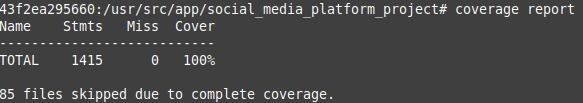

# Python/Django Challenge

This document contains:

- Instructions to start the service 
- System characteristics
- Comments on decisions made during development
- Optimizations performed
- Possible improvements

The resolution was based on the requirements found in the file [Challenge](./CHALLENGE.md).

## Instructions to start the service

***Requirements**: docker and docker-compose.*

1. Clone the repository.
2. Enter the docker folder
3. Execute:
    ```bash
    docker-compose build
    ```
4. Execute:
    ```bash
    docker-compose up -d
    ```
   The first time may fail to start because Django starts before PostgreSQL. If this happens run the command again.

- Running the tests
    ```bash
    docker exec -it social_media_platform_backend /bin/bash
    cd social_media_platform_project/
    python manage.py test --parallel
    ```
- Running coverage (in container)
    ```bash
    coverage run --source="." manage.py test
    ```
    


- API Documentation: [Swagger](http://127.0.0.1:8081/swagger) 

## System characteristics

The system has three services:
- Backend: Python/Django (4.2 LTS).
- Database: PostgreSQL.
- Web Server: Ngix.

*It was probably not necessary to use PostgreSQL or Nginx.*

## Comments on decisions made during development

- I generally avoided adding business logic to models and serializers. I preferred to develop services that contain the application logic “isolated” from the framework's own functionalities. Depending on the context of the system and its evolution this is correct.
Django Rest Framework induces to have logic in the models and serializers.
- The “Social media user” model inherits from the AbstractUser model provided by Django. This is completely questionable since I am mixing system logic with framework logic. The only benefit is simplicity for development and the efficiency of using a single table
- The standard for API parameter names was not specified. I decided to use the same names as the model attributes 
- The definition of the URLs are outside of the applications, this does not necessarily have to be so. For this example I considered that it was not the responsibility of each application to define its URLs.
- In general I used viewsets blocking some of their methods. However, it may be considered more appropriate to inherit directly from the appropriate mixins.
- For simplicity and to use some of the Django Rest Framework tools I incorporated several ModelSerializers. In case you need to improve the performance of some endpoint you can exclude them and take their functionality to the query in the database.
- For filtering and paging use tools provided by DRF, if more performance is required, custom development is possible.

## Optimizations performed

When using model serializers there is a risk that they run extra queries to obtain data. While extremely practical, they can be very inefficient.

1. To avoid this, use the **select_related** and **prefetch_related** tools to obtain the associated entities in the same query. This way you can avoid new queries later.

    An example of this

    ```python
        user = cls.model.objects.filter(
            id=social_media_user_id
        ).prefetch_related(
            'followed',
            'followers'
        ).annotate(
            total_posts=Count('posts', distinct=True),
            total_comments=Count('comments', distinct=True)
        ).get()
    ```

2. The above code also includes the use of the **Count** operator to count posts and comments in the same query.
   
3. Django Rest Framework provides functions like  *get_object* or *get_object_or_404*  that are very useful but inefficient because they get the instance from the base when it is not necessarily needed.

    Implement the function **exists_object_or_404** that performs an **exists** to the database and therefore is more efficient than getting the instance. 

    ```python
        def exists_object_or_404(model, id: int) -> bool:
            """
            Return True if object exists or raise 404 error.
            args:
                model: model class
                id: id of object
            return:
                bool: true if object exists
            """
            exists = model.objects.filter(id=id).exists()
            if exists:
                return True
            raise NotFound('No %s matches the given query.' % model._meta.object_name)

    ```


## Possible improvements

- It is a good practice (in some cases) to prevent services from directly querying the database. In this case I did not implement repositories but it could be an improvement in the separation of responsibilities for the system.
